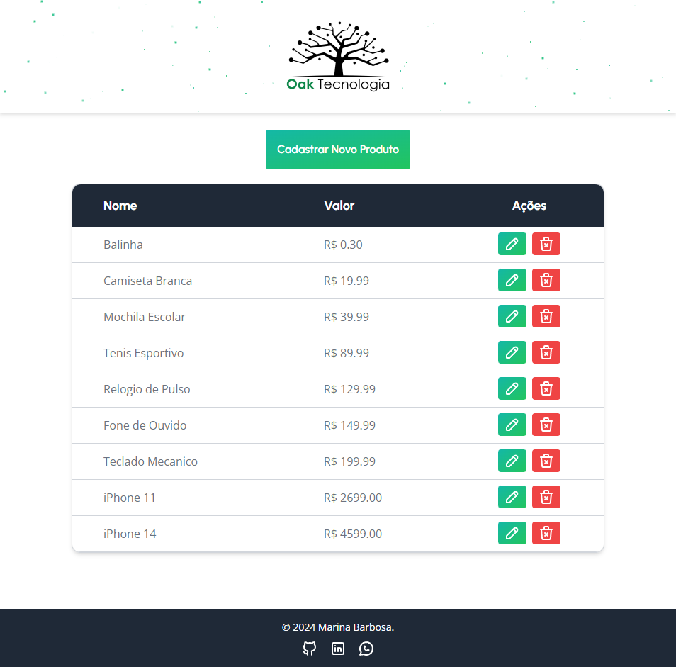
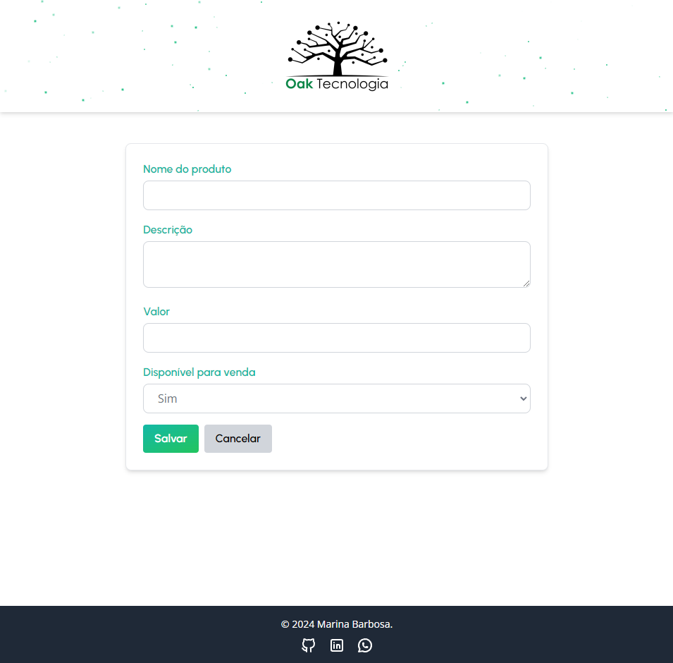
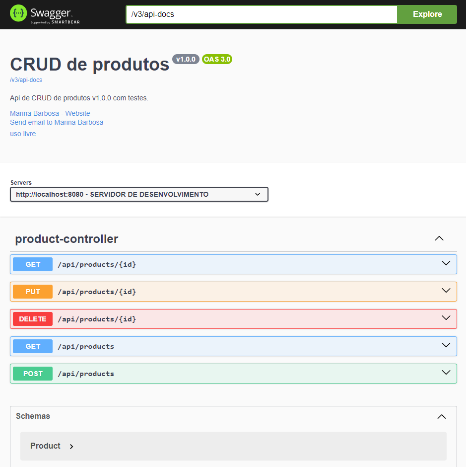

# oak-dev-frontend

Prova experimental de qualificação de candidato Estágio de desenvolvimento na Oak tecnologia.

Este é o frontend do sistema de CRUD de produtos, desenvolvido com React.

Frontend: https://oakdev.netlify.app/

Deploy: https://oak-dev-backend.onrender.com/swagger-ui/index.html

<br>

## Funcionalidades

- **Listagem de Produtos**: Exibe todos os produtos cadastrados na API.
- **Formulário de Produtos**: Permite cadastrar, editar e deletar produtos.

<br>







<br>


## Tecnologias Utilizadas

- **React**: Biblioteca para criação da interface.
- **Vite**: Ferramenta de build rápida para desenvolvimento com React.
- **Tailwind CSS**: Framework de CSS utilitário para estilização rápida.
- **Tabler Icons**: Biblioteca de ícones open-source usados na interface.
- **Jest**: Framework de testes para JavaScript.
- **React Testing Library**: Utilitário para testes de componentes React.

<br>

## Como Executar o Projeto

**Clone o repositório**:
```
git clone git@github.com:marina-barbosa/oak-dev-frontend.git

cd frontend-products
```

**Instale as dependências**:
```
npm install
```

**Execute o servidor de desenvolvimento**:
```
npm run dev
```
